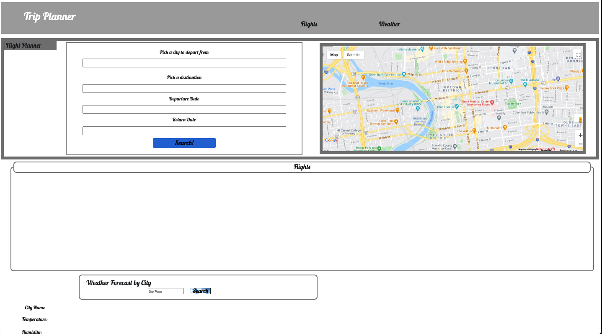
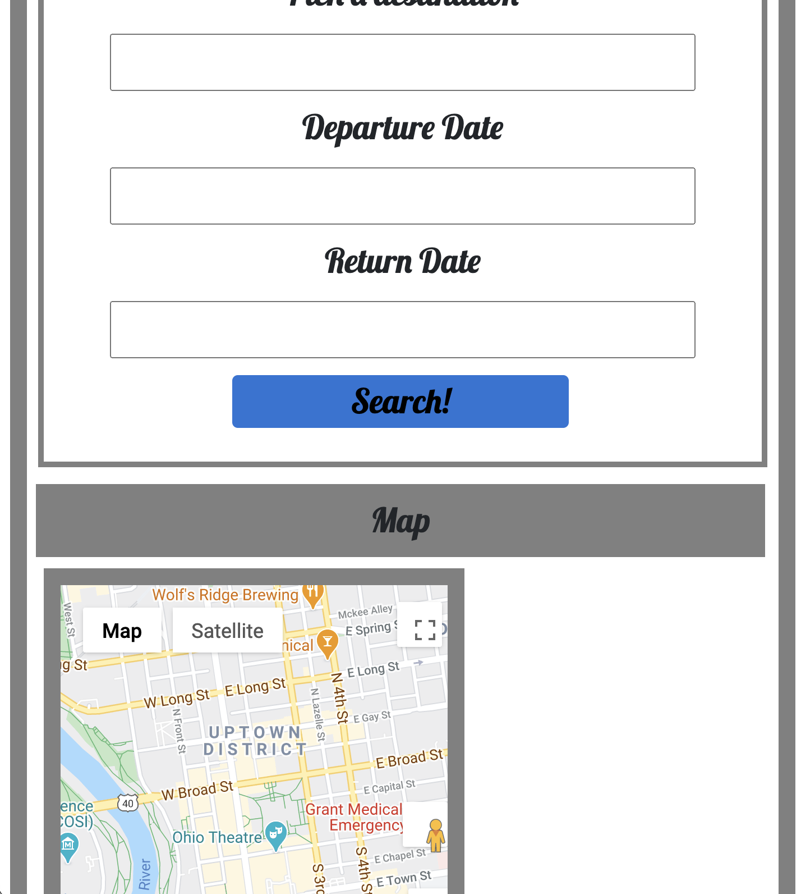

# Travel Planner

## Description
***
Our Travel Planner is a one stop shop for seeing all the information you need to plan a trip. Just put in your destination and dates one time to find cheap flights, free things to do, and the forecast

### User Story
***
AS someone who travels frequently\
WHEN I plan a trip\
THEN I see flight prices, attractions and a forecast

### Technologies Used
***
`HTML, CSS, JS, SkyScanner API, Google Maps API`

## Screenshot
***

## Links
***
Deployed App - https://thebsking.github.io/travel-planner

Repo - https://github.com/thebsking/travel-planner

## License

## Contributors
***
Brandon King, Brandon Waller, Kyle Euman